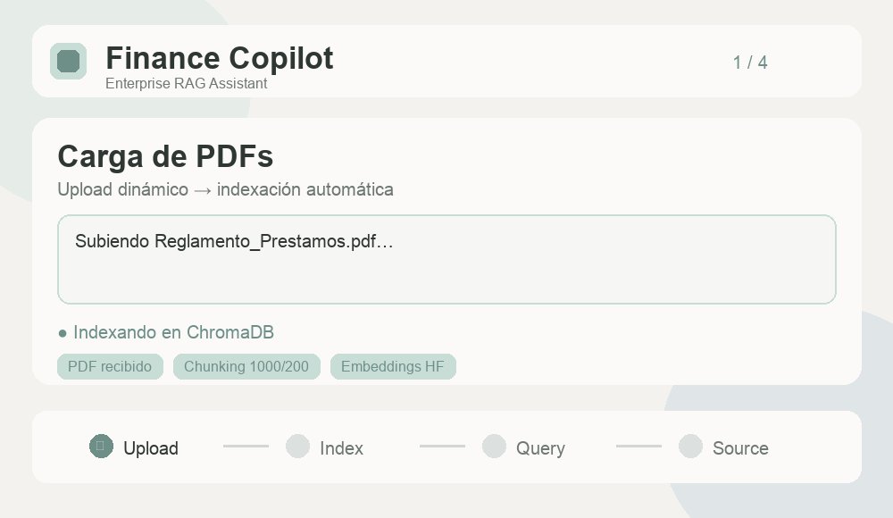

# Finance Copilot – Enterprise RAG Assistant

Asistente empresarial de **RAG** (Retrieval-Augmented Generation) para consultar documentación financiera interna en lenguaje natural.

Subí PDFs, indexalos automáticamente y obtené respuestas ancladas **únicamente** al contexto recuperado, con cita de documento y página.



> Flujo: carga de PDFs → indexación → consulta → respuesta con fuente.

## Flujo de demo

1. **Subí un PDF** con el botón de arriba a la derecha → se indexa automáticamente  
2. **Hacé una pregunta** desde el panel demo o el chat  
3. Observá el **pipeline RAG** en vivo  
4. Revisá la **respuesta**, las **fuentes** (documento + página) y el **Retrieved Context**  

---

Los Large Language Models son potentes, pero **no pueden responder de forma confiable** sobre conocimiento privado o específico de una empresa.

Este proyecto demuestra cómo el **Retrieval-Augmented Generation (RAG)** permite anclar las respuestas en documentación interna confiable, **reduciendo alucinaciones** y mejorando la confiabilidad de las respuestas.

La aplicación fue diseñada siguiendo **buenas prácticas de AI Engineering**, separando en componentes modulares:

- ingestión de documentos  
- almacenamiento vectorial  
- recuperación semántica  
- orquestación de prompts  
- generación de respuestas  


---

## Destacados

- 📄 **Carga dinámica** de documentos PDF  
- 🔎 **Búsqueda semántica** mediante ChromaDB  
- 🧠 **Respuestas con LLM** usando únicamente el contexto recuperado (RAG)  
- 📚 **Citas automáticas** con documento y página  
- 🗂️ **Historial de conversaciones** (memoria con LangGraph)  
- ⚡ **Backend en FastAPI** y **frontend en React**  
- 🔄 **Arquitectura modular** basada en LangChain, orquestada con LangGraph  

También incluye:

- pipeline RAG visible en la UI (search → retrieve → generate → validate)  
- retrieved context con score del chunk más similar  
- stack 100% local (HuggingFace embeddings + Ollama)

---

```
Usuario
  → React (UI)
  → FastAPI (/upload · /query · /status)
  → LangGraph
        analyze_question
        → search_documents
        → generate_answer
        → validate_answer
  → ChromaDB (retrieval) + Ollama Llama 3.2 (generación)
  → Respuesta + fuentes + contexto recuperado
```

---

## Stack tecnológico

| Capa | Tecnología |
|------|------------|
| Backend | Python · FastAPI |
| Orquestación | LangChain · LangGraph |
| Embeddings | HuggingFace `all-MiniLM-L6-v2` |
| LLM | Ollama · Llama 3.2 (local) |
| Vector DB | ChromaDB |
| Frontend | React · Material UI · Vite |
| Infra | Docker Compose |

---

## Cómo levantarlo

### Opción recomendada: Docker

```bash
docker compose up --build
```

La primera vez descarga imágenes, embeddings y el modelo `llama3.2` (puede tardar varios minutos).

| Servicio | URL |
|----------|-----|
| Aplicación | http://localhost |
| API / Swagger | http://localhost:8000/docs |

No hace falta configurar `.env` ni servicios externos: Compose levanta backend, frontend, Ollama y los volúmenes de datos.

Para detener:

```bash
docker compose down
```

---

### Opción local (sin Docker)

**Requisitos**

- Python 3.11+  
- Node.js 18+  
- [Ollama](https://ollama.com) instalado  

```bash
# 1) Variables de entorno
cp .env.example .env

# 2) Modelo local
ollama pull llama3.2
ollama serve

# 3) Backend (desde la raíz del repo)
python -m venv .venv
source .venv/bin/activate          # Windows: .venv\Scripts\activate
pip install -r requirements.txt
uvicorn backend.app.main:app --reload --port 8000

# 4) Frontend (otra terminal)
cd frontend
npm install
npm run dev
```

| Servicio | URL |
|----------|-----|
| Aplicación | http://localhost:5173 |
| API / Swagger | http://localhost:8000/docs |

---


## API principal

| Método | Path | Descripción |
|--------|------|-------------|
| `POST` | `/upload` | Sube un PDF e indexa |
| `GET` | `/status` | Estado del índice |
| `POST` | `/query` | Consulta RAG con memoria (`thread_id`) |
| `POST` | `/retrieve` | Solo retrieval semántico |
| `GET` | `/documents/{filename}` | Sirve un PDF indexado |

---

## Mejoras futuras

- Autenticación y multi-usuario  
- Opción de LLM en la nube (Azure OpenAI / equivalentes)  
- Streaming de tokens (SSE)  
- Persistencia en PostgreSQL  
- Despliegue en Kubernetes  

---

## Licencia

Proyecto de portfolio — uso educativo y demostrativo.
